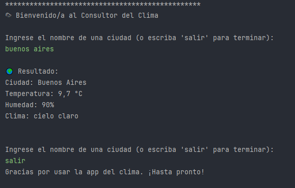

# 🌦 Consultar Clima - Java

Aplicación de consola desarrollada en Java para consultar el clima actual de cualquier ciudad usando la API de OpenWeatherMap.

---

## 🎯 Funcionalidades

- Permite consultar el clima actual ingresando el nombre de una ciudad.
- Muestra:
    - Ciudad
    - Temperatura (°C)
    - Humedad (%)
    - Descripción del clima (por ejemplo: "cielo claro", "lluvia ligera")
- Repite el menú hasta que el usuario escriba `salir`.
- Maneja errores si la ciudad no es válida o hay problemas con la API.

---

## 🖼️ Captura de pantalla



---

## 🛠️ Tecnologías usadas

- Java 21
- IntelliJ IDEA
- API: [OpenWeatherMap](https://openweathermap.org/)
- Gson para parseo de JSON
- `java.net.http.HttpClient` para solicitudes HTTP
- Git y GitHub

---

## 🧾 Estructura del proyecto

```
consultar-clima/
│
├── src/
│ └── com.dargorvz.clima/
│   ├── ClimaApp.java
│   ├── ClimaApi.java
│   ├── Clima.java
│   ├── Main.java
│   ├── RespuestaClima
│   └── Weather.java
│
├── capturas/
│ └── ejemplo.png
│
├── .gitignore
├── README.md
└── apikey.txt (no se sube a GitHub, contiene la API Key)
```

---

## 🔐 Gestión de la API Key

La API Key se almacena en el archivo `apikey.txt`, que **no está incluido en el repositorio**. Para probar la app, debés crear este archivo en el directorio raíz del proyecto con tu api key la cual la consigues en OpenWeatherMap.


---

## 👤 Autor

- Nombre: **Darío Vizcarra**
- Proyecto personal
- GitHub: [@DargorVZ](https://github.com/DargorVZ)

---

## 📌 Notas

- Es necesario tener conexión a Internet para obtener los datos del clima.
- Asegurate de que tu API Key sea válida y esté bien configurada en `apikey.txt`.
